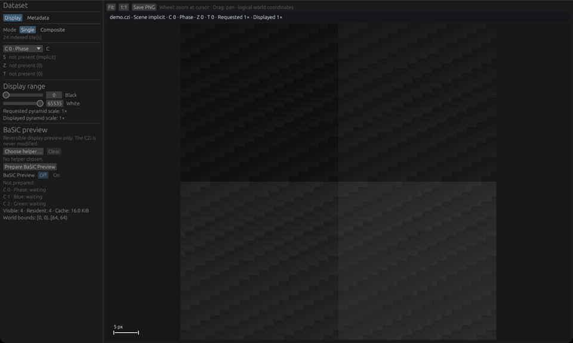

# CZI Viewer

> **Apple Silicon preview (unsigned):** Download the DMG from [Releases](https://github.com/joshwhiteley/czi-viewer/releases), drag **CZI Viewer** to Applications, then use Finder's unsigned-app confirmation on first launch.

Open large CZI mosaics, inspect channels and metadata, and save an annotated view without loading the whole image.

## Demo

*Real CZI Viewer capture using only the repository's synthetic three-channel demo CZI. [Asset provenance and privacy details](assets/README.md).*

## Open, explore, export

1. **Open** a local CZI with **Choose CZI…** or drag and drop, or use an existing SSH profile to browse a read-only remote source.
2. **Explore** the mosaic: pan and zoom, choose sparse C/S/Z/T planes, tune channel display, and inspect metadata.
3. **Export** the current annotated canvas as a PNG.

## What it can do

- View tiled, pyramidal CZI mosaics without a dense full-mosaic load.
- Display uncompressed Gray8 and Gray16 tiles.
- Select observed channels, scenes, Z positions, and time points.
- Name channels and show calibrated scale bars from CZI metadata.
- Open local files or read-only remote files through system OpenSSH SFTP.
- Build channel composites with independent contrast/gamma, bounded raw preview histograms, and auto-contrast.
- Prepare a reversible BaSiC flat-field preview on demand, or enable automatic preparation in Settings.
- Use recent local files, keyboard shortcuts, view bookmarks, an overview map, and adjustable interface scaling.
- Export through a native Save As dialog or copy the canvas to the clipboard.
- Check authenticated GitHub preview releases daily and install a verified DMG only after user confirmation.

## Current limits

- This is a macOS-first preview, not a validated analysis workflow.
- Compressed CZI pixel codecs are not supported yet.
- Export is an annotated PNG view, not CZI or TIFF conversion.
- BaSiC preview is display-only and explicitly not quantitatively validated.
- CZI Viewer never modifies a local or remote source CZI.

## Learn more

- [User guide](docs/user-guide.md) — opening, viewing, remote access, export, and the synthetic demo file.
- [Format support](docs/format-support.md) — supported CZI subset and metadata behavior.
- [Development](docs/development.md) and [architecture](docs/architecture.md) — build, tests, safety boundaries, and design.
- [Embedded SSH](docs/embedded-ssh.md), [BaSiC preview](docs/basic-preview.md), and [AnyConnect VPN](docs/anyconnect-vpn.md) — optional connection and preview details.
- [Distribution](docs/distribution.md), [dependency policy](docs/dependency-policy.md), and [implementation provenance](docs/provenance.md).

Maintainers can build and publish the current version with `scripts/release-preview.sh --publish`; see [distribution](docs/distribution.md) for the release checks.

CZI Viewer is an independent project. It is not affiliated with, endorsed by, or sponsored by ZEISS.

## License

Licensed under either [Apache-2.0](LICENSE-APACHE) or [MIT](LICENSE-MIT), at your option.
